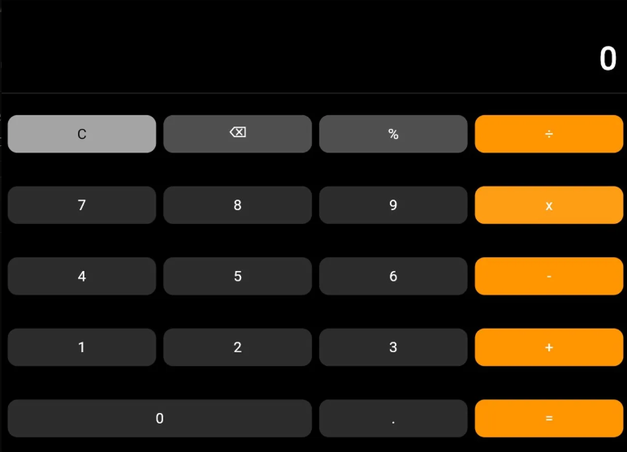

# Calculadora Flutter

**Estudante:** Bruno Coelho Hasse

---

## Descrição da Aplicação

Aplicativo de calculadora desenvolvido em Flutter, executado no navegador via Flutter Web. Permite realizar operações matemáticas básicas com uma interface inspirada no estilo de calculadoras modernas, com fundo escuro e botões de operação em laranja.

---

## Estrutura de Componentes

O projeto utiliza componentização de widgets, separando a interface em partes reutilizáveis:

### `DisplayCalculadora`
Widget responsável por exibir a expressão atual e o resultado na parte superior da tela. Recebe `expressao` e `resultado` como parâmetros e os exibe alinhados à direita com tamanhos diferentes para hierarquia visual.

### `BotaoCalculadora`
Widget reutilizável que representa cada botão da calculadora. Aceita os seguintes parâmetros:
- `texto` — rótulo exibido no botão
- `corFundo` — cor de fundo do botão
- `corTexto` — cor do texto
- `aoPressed` — função executada ao pressionar
- `largo` — booleano opcional para botões que ocupam o dobro do espaço (ex: botão 0)

### `CalculadoraPage`
Página principal com estado (`StatefulWidget`) que controla toda a lógica da calculadora: entrada de números, seleção de operador, cálculo do resultado e limpeza.

---

## Funcionalidades

- Inserção de números e ponto decimal
- Operações: adição, subtração, multiplicação e divisão
- Exibição da expressão e do resultado em tempo real
- Limpeza total (C) e apagar último dígito (⌫)

---

## Como Executar

### Pré-requisitos

- [Flutter SDK](https://flutter.dev/docs/get-started/install) instalado
- Google Chrome instalado

### Passos

1. Clone o repositório:
   ```bash
   git clone https://github.com/BrunoCoelhoH/trabalho3-mobile-flutter.git
   ```

2. Acesse a pasta do projeto:
   ```bash
   cd trabalho3-mobile-flutter
   ```

3. Execute no navegador:
   ```bash
   flutter run -d chrome
   ```

---

## Interface


